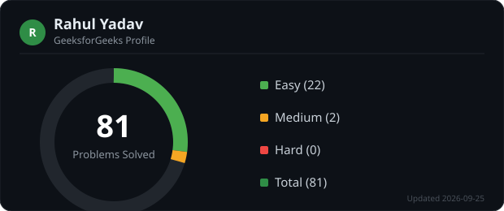

# 👋 Hi, I'm Rahul Yadav

---

### 🚀 Aspiring AI Engineer | Python Developer | FastAPI Developer

---

# 👨‍💻 About Me

- 🎓 B.Tech Computer Science Student
- 🤖 Passionate about Artificial Intelligence
- 🐍 Python Developer
- ⚡ FastAPI Backend Developer
- 🌱 Currently Learning
  - Machine Learning
  - Deep Learning
  - Large Language Models
  - Computer Vision
- 💡 Love Building Real World Projects

---

# 🚀 Tech Stack

---

# 🧑‍💻 Coding Profiles

  

  

---

# 💻 Languages

---

# 🛠 Frameworks & Tools

---

# 🎯 Current Focus

✅ Artificial Intelligence
✅ Machine Learning
✅ Deep Learning
✅ FastAPI
✅ Backend Development
✅ Open Source

---

# 📌 Featured Projects

🚀 GitHub Repository Scanner
🥛 Aapni Dairy App
🤖 AI Projects
📈 Machine Learning Projects

---

# 📈 Contribution Graph

---

# 📫 Connect With Me

---

# 💭 Quote

> **"Code. Learn. Build. Repeat." 🚀**

---

### ⭐ Thanks for visiting my profile!

If you like my work, don't forget to ⭐ my repositories.

